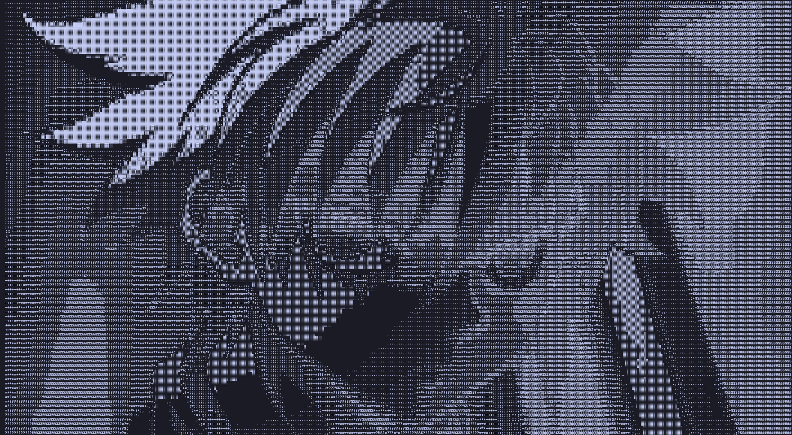
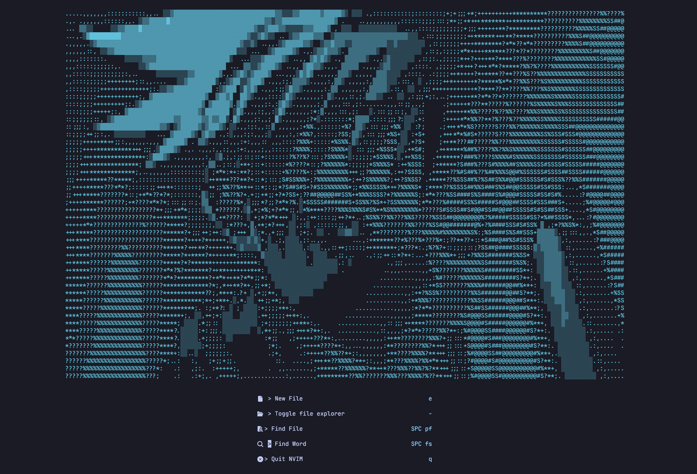

# ASCII Art Converter

This Python project converts images into ASCII art and saves the results both as a PNG file and as plain text. The tool can be used to generate ASCII representations of images, which can then be displayed in terminals, text editors, or dashboards like Neovim's `alpha-nvim`.

## Features

- Converts images to ASCII art.
- Saves ASCII art as both a text file and a PNG image with a transparent background.
- Customize font, image resizing, and ASCII character mappings.
- Optimized for terminal-based editors like Neovim.

## Screenshot

Here's a few pieces of example art generated by this tool:




And here's an example Neovim dashboard:



## Requirements

- Python 3.x
- Pillow (Python Imaging Library)

Make sure you are in a virtual environment and then install the required dependencies (only Pillow) by running:

```bash
pip install -r requirements.txt
```
